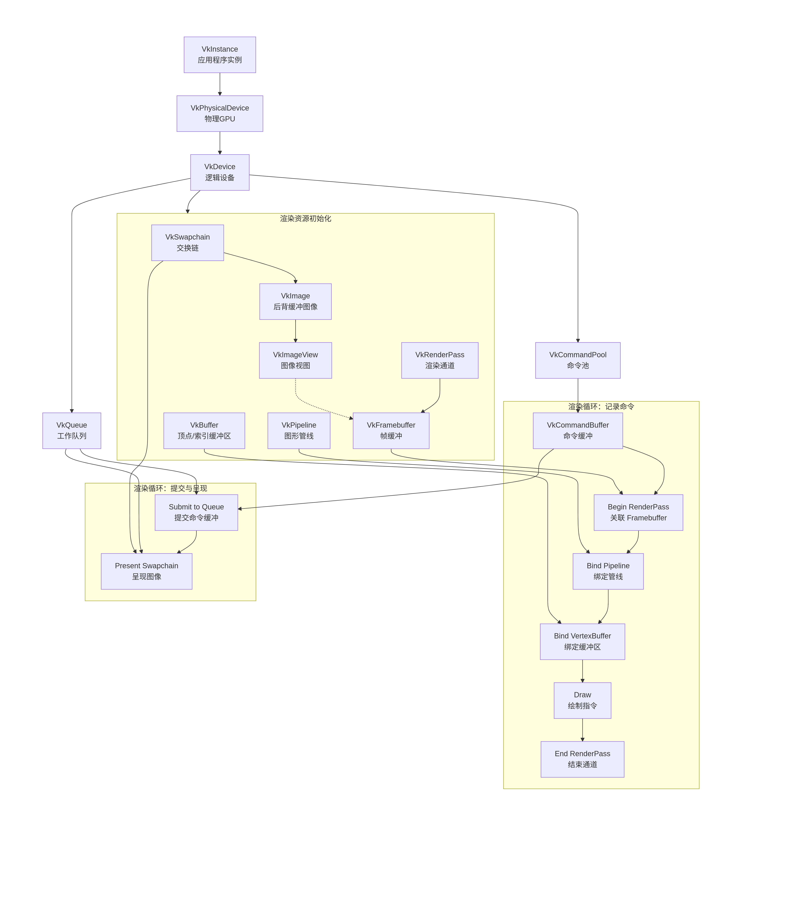

### 核心思想

Vulkan 是一个显式 API，意味着你需要手动管理几乎所有事情。这就像你不是在买一个精装房（如 OpenGL），而是在拿到一块毛坯地后，自己担任总工程师，亲自设计蓝图、雇佣施工队、购买材料并指挥建造。

---

### 主要“角色”（核心数据结构）

1.  **VkInstance（实例）**
    *   **比喻**：你的**建筑公司执照**。
    *   **作用**：它代表了你的应用程序在整个系统中的身份。创建 Instance 时，你告诉 Vulkan 驱动你需要哪些全局扩展（比如窗口系统集成、调试功能）。

2.  **VkPhysicalDevice（物理设备）**
    *   **比喻**：市场上可用的**显卡**。
    *   **作用**：它代表系统中的一个实际 GPU硬件。在创建 Instance 后，你需要枚举并选择一个合适的 PhysicalDevice。你可以查询它的属性（如显卡型号、VRAM 大小）和功能。

3.  **VkDevice（逻辑设备）**
    *   **比喻**：你为这个特定工程**雇佣的专属施工队**。
    *   **作用**：它代表你与特定 GPU（PhysicalDevice）交互的抽象接口。你创建 Logical Device 时，需要指定要启用这个显卡的哪些具体功能（比如几何着色器）和队列家族。

4.  **VkQueue（队列）**
    *   **比喻**：施工队里的**不同工种班组**。
    *   **作用**：GPU 执行工作的通道。常见的队列类型有：
        *   **图形队列（Graphics Queue）**：负责绘图、计算等核心任务。
        *   **传输队列（Transfer Queue）**：专门负责数据传输（如纹理上传）。
    *   工作（指令）被提交到队列中，由 GPU 异步执行。

5.  **VkSwapchain（交换链）**
    *   **比喻**：房子正面的**可翻转广告牌**（通常是三面）。
    *   **作用**：它管理着一组图像（VkImage），用于在窗口上显示内容。它实现了双缓冲或三缓冲，以避免撕裂。你从交换链“获取”一个图像来绘制，绘制完成后“呈现”回交换链以显示到屏幕。

6.  **VkImage / VkBuffer（图像/缓冲区）**
    *   **比喻**：**原材料**。
    *   **作用**：
        *   `VkImage` 用于存储纹理、附件（深度、模板缓冲）。
        *   `VkBuffer` 用于存储顶点数据、索引数据、统一变量（Uniforms）等。

7.  **VkImageView / VkBufferView（图像视图/缓冲区视图）**
    *   **比喻**：原材料的**加工规格说明书**。
    *   **作用**：它们描述了如何解读一块原始数据（Image/Buffer）。例如，一个 VkImage 可以被视为 2D 纹理还是立方体贴图？它的哪个 Mip 级别和图层范围可以被访问？管线在着色器中访问的是 View，而不是原始的 Image/Buffer。

8.  **VkRenderPass（渲染通道）**
    *   **比喻**：一个**施工阶段的工作流程蓝图**。
    *   **作用**：它预先声明了一次渲染过程中所涉及的附件（如颜色附件、深度附件）、它们的用途（是清除、保留内容还是作为呈现目标），以及子通道之间的依赖关系。这允许驱动进行深度的优化。

9.  **VkFramebuffer（帧缓冲）**
    *   **比喻**：根据蓝图**组装好的具体画布和画板**。
    *   **作用**：它将 RenderPass 中声明的附件（VkImageView）具体关联起来。一个 Framebuffer 通常对应交换链中的一个图像。

10. **VkPipeline（管线）**
    *   **比喻**：一个高度专业化的**自动化流水线机器**。
    *   **作用**：它封装了渲染的整个可配置状态：顶点输入格式、着色器模块、光栅化设置、深度测试、混合模式等。绘制前必须创建并绑定一个 Pipeline。改变状态（如从 opaque 变为 transparent）通常需要切换不同的 Pipeline。

11. **VkCommandBuffer（命令缓冲）**
    *   **比喻**：**施工指令清单**。
    *   **作用**：你在这里记录具体的 GPU 命令，例如“开始渲染通道”、“绑定管线”、“绑定顶点缓冲区”、“绘制”、“结束渲染通道”。它不是立即执行的，而是先记录，再提交到 Queue 去执行。

---

### “施工”流程（它们如何合作）

假设你已经创建好了 Instance, PhysicalDevice, Device，并获取了 Queue。

1.  **初始化阶段（搭建舞台）**
    *   创建 **Swapchain**，它内部管理着多个 **VkImage**。
    *   为 Swapchain 的每个 Image 创建对应的 **ImageView**。
    *   创建 **RenderPass**，定义你的渲染流程（例如，使用一个颜色附件，并在开始时清除它）。
    *   为 Swapchain 的每个 Image 创建 **Framebuffer**，将对应的 ImageView 关联到 RenderPass 中定义的附件上。
    *   编译着色器，创建你需要的 **Pipeline**（例如，一个绘制三角形的管线）。

2.  **渲染循环（每一帧）**
    *   **记录命令（写施工清单）**：
        a. 从 **Command Pool**（命令池，用于分配 CommandBuffer 的内存管理器）获取一个 **VkCommandBuffer**。
        b. 开始记录 CommandBuffer。
        c. 从 **Swapchain** “获取”下一个可用的图像索引。
        d. 在 CommandBuffer 中记录命令：
            *   `vkCmdBeginRenderPass`：开始渲染通道，并指定使用哪个 **Framebuffer** 和 **RenderPass**。
            *   `vkCmdBindPipeline`：绑定你要使用的 **Pipeline**。
            *   `vkCmdBindVertexBuffers`：绑定你的顶点 **Buffer**。
            *   `vkCmdDraw`：发出绘制指令。
            *   `vkCmdEndRenderPass`：结束渲染通道。
        e. 结束记录 CommandBuffer。

    *   **提交与执行（派发施工队干活）**：
        a. 将录制好的 **CommandBuffer**，连同信号量（Semaphore，用于同步）一起，提交到 **Graphics Queue**。
        b. GPU 在 Queue 中执行这些命令，将结果绘制到 Framebuffer 关联的 Image 上。
        c. 将绘制完成的 Image 再“呈现”回 **Swapchain**，请求显示到窗口。

    *   **同步（等待完工）**：
        *   使用信号量（Semaphore）和栅栏（Fence）来确保 CPU 和 GPU 之间、GPU 内部不同任务之间的正确同步，例如，等待图像获取完成后再开始绘制，等待绘制完成后再进行呈现。

### 总结关系图

```
VkInstance
    |
    |---> 枚举 VkPhysicalDevice
    |
    |---> 创建 VkDevice
            |
            |---> 获取 VkQueue (Graphics, Present等)
            |
            |---> 创建 VkSwapchain
            |        |
            |        |---> 包含 VkImages
            |        |---> 为每个 Image 创建 VkImageView
            |
            |---> 创建 VkRenderPass
            |
            |---> 为每个 Swapchain Image 创建 VkFramebuffer (关联 ImageView 和 RenderPass)
            |
            |---> 创建 VkPipeline (指定着色器、状态等)
            |
            |---> 分配 VkCommandBuffer
                    |
                    |---> 记录命令：BeginRenderPass(Framebuffer, RenderPass) -> BindPipeline -> BindVertexBuffer(Buffer) -> Draw -> EndRenderPass
                    |
                    |---> 提交 VkCommandBuffer 到 VkQueue
                            |
                            |---> GPU 执行，结果写入 Swapchain 的 Image
                            |
                            |---> 将 Image 呈现回 Swapchain 显示
```

这个流程虽然步骤繁多，但赋予了开发者极高的控制权和优化空间，这也是 Vulkan 高性能的关键所在。


### 基本流程图


### 图解工作流程

这个流程图可以分为三个主要阶段：

**1. 初始化阶段（设置舞台与工人）**
*   **左上部分**：从 `VkInstance` 开始，找到物理设备 `VkPhysicalDevice`，并创建逻辑设备 `VkDevice`。`VkDevice` 提供了 `VkQueue`（执行工作的工人）和 `VkCommandPool`（用于分配命令缓冲的工具箱）。

**2. 资源创建阶段（准备工具与材料）**
*   **中间部分**：创建所有渲染所需的资源。
    *   `VkSwapchain` 管理一系列 `VkImage`（画布），并为每个图像创建 `VkImageView`（如何解读这块画布）。
    *   `VkRenderPass` 定义了渲染流程，`VkFramebuffer` 则将具体的图像视图关联到这个流程上。
    *   `VkPipeline` 是配置好的绘图机器，`VkBuffer` 是存储顶点等数据的容器。

**3. 渲染循环阶段（每帧的绘制工作）**
*   **下半部分**：这是每一帧中发生的核心操作。
    *   **记录命令**：从命令池分配一个 `VkCommandBuffer`，然后按顺序记录指令（开始渲染通道、绑定管线、绑定缓冲区、绘制……）。这些指令最终都指向在初始化阶段创建好的各种资源（`Framebuffer`, `Pipeline`, `Buffer`）。
    *   **提交与呈现**：将录制好的命令缓冲提交到 `VkQueue` 执行。GPU 执行完毕后，再将绘制完成的图像通过队列呈现给 `VkSwapchain`，显示到屏幕上。

这个图表和说明展示了 Vulkan 的显式控制特性：每一个资源、每一个步骤都需要你清晰地创建、管理和关联起来。